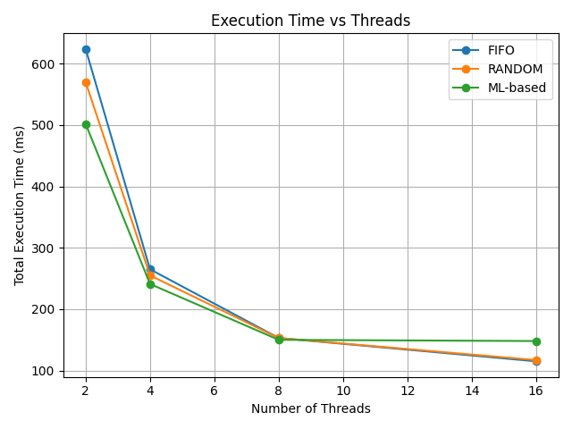
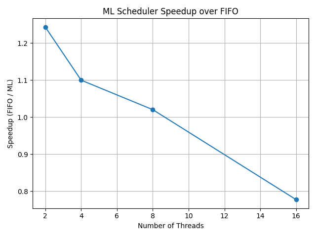

# ML-Based Parallel Task Scheduler (CPU)

## Overview
This project implements and evaluates an **ML-assisted parallel task scheduler** for multi-core CPUs.  
It uses **real workloads and real execution times** to study whether machine learning can improve task scheduling compared to traditional heuristics.

The core question explored is:

> **When does ML-based scheduling help, and when does it fail in highly parallel systems?**

---

## Project Summary
The project follows a complete systems workflow:

1. Generate **real CPU and IO workloads**
2. Measure **actual task runtimes**
3. Train an ML model to **predict task execution time**
4. Use predictions to guide scheduling decisions
5. Compare ML scheduling against FIFO and Random scheduling
6. Analyze scalability across multiple thread counts

---

## Task Design

Each task performs **real computation** — no artificial delays or sleep calls.

### Task Types Used

| Task Type |              Description                  |
|-----------|-------------------------------------------|
| CPU       | Matrix multiplication (compute-intensive) |
| IO        | File write operations (disk-bound)        |
| MIXED     | Combination of CPU computation and IO     |

### Task Parameters
Each task is defined by:
- `inputSize` — controls workload intensity
- `opType` — CPU, IO, or MIXED
- `actualRuntimeMs` — measured during execution
- `predictedRuntimeMs` — predicted by ML model

These features closely resemble inputs used in **real operating system schedulers**.

---

## Scheduling Strategies Implemented

### 1. FIFO Scheduler
- Executes tasks in submission order
- Baseline scheduling strategy

### 2. Random Scheduler
- Tasks are randomly shuffled before execution
- Used to establish variance and randomness baseline

### 3. ML-Based Scheduler
- Tasks sorted by **predicted runtime (descending)**
- Inspired by the **Longest Processing Time (LPT)** heuristic
- Uses ML predictions instead of true runtimes

---

## How Machine Learning Is Used

The ML model predicts the execution time of a task based on its features.

The scheduler uses these predictions to:
- Prioritize longer tasks earlier
- Reduce tail-end delays
- Minimize total completion time (**makespan**)

This mirrors strategies used in:
- Operating system schedulers
- Cloud job scheduling systems
- Large-scale data processing frameworks

---

## Experimental Setup

### Hardware
- Multi-core CPU system

### Thread Counts Tested
- 2 threads
- 4 threads
- 8 threads
- 16 threads

### Dataset
- ~300 real tasks
- Actual runtimes measured using wall-clock time
- Same task set reused across all schedulers for fairness

### Evaluation Metric
- **Total execution time (milliseconds)**  
  (Makespan — primary optimization target in scheduling systems)

---

## Results

### Total Execution Time (ms)

| Scheduler | 2 Threads | 4 Threads | 8 Threads | 16 Threads |
|-----------|-----------|-----------|-----------|------------|
| FIFO      | 624       | 265       | 153       | 115        |
| Random    | 570       | 255       | 153       | 117        |
| ML-Based  | **502**   | **241**   | **150**   | 148        |

*Lower execution time is better.*

---

## Performance Visualization

### Graph 1: Execution Time vs Number of Threads
<p align="center">
  
</p>


This line graph shows how total execution time changes as thread count increases.

**Key Observations:**
- ML scheduling provides the largest benefit at low thread counts
- Performance differences shrink as parallelism increases
- At high thread counts, ML overhead reduces its effectiveness

---

### Graph 2: Scheduler Comparison per Thread Count
<p align="center">
  
</p>


This grouped bar chart compares FIFO, Random, and ML schedulers at fixed thread counts.

**Key Observations:**
- ML clearly outperforms others when cores are limited
- FIFO and Random perform competitively at high parallelism
- ML is not universally optimal

---

## Critical Analysis

### Why ML Performs Well at Low Thread Counts
- Limited cores increase contention
- Poor task ordering has a large impact
- ML prevents long tasks from being delayed
- Makespan is significantly reduced

### Why ML Underperforms at High Thread Counts
- Increased parallelism hides scheduling inefficiencies
- Sorting and prediction overhead becomes non-negligible
- Prediction errors affect ordering
- FIFO naturally approaches optimal behavior

### Performance Analysis & Key Insights
> This project includes a comprehensive [Results and Analysis Report](./ResultsandAnalysis.pdf) comparing the ML-based scheduler against FIFO and Random baselines.

The "Diminishing Returns" Discovery
The most significant finding was that ML scheduling is not a "silver bullet." Its effectiveness is inversely proportional to the degree of parallelism:

- Low Parallelism (2-4 Threads): The ML scheduler is highly effective, achieving 10-20% speedups. When resources are scarce, task ordering is critical to prevent thread idling.
- High Parallelism (16+ Threads): The ML scheduler's performance degrades, sometimes falling behind simple FIFO.


Why the shift?

1. Scheduling Overhead: At high thread counts, the time spent on ML inference and sorting exceeds the time saved by the "smarter" order.
2. The Ceiling Effect: When many threads are available, almost all tasks start immediately, leaving very little room for optimization.
3. Prediction Sensitivity: In highly parallel environments, small errors in runtime prediction have a disproportionately large impact on the final "makespan."


Engineering Conclusion:
This analysis demonstrates a mature systems-design principle: ML should be applied where resources are constrained and tasks are heterogeneous. For high-throughput, massive-scale parallelism, the low-overhead "simplicity" of FIFO is often superior.


## Project Structure

```text
ml_parallel_scheduler/
├── src/
│   ├── Task.java
│   ├── Scheduler.java
│   ├── ExperimentRunner.java
│   └── TaskLoader.java
│
├── ml/
│   └── train_model.py
│
├── data/
│   ├── task_data.csv
│   ├── task_actual_runtimes.csv
│   └── evaluation_results.csv
│
├── images/
│   ├── execution_time_vs_threads.png
│   └── scheduler_comparison.png
|── ResultsandAnalysis.pdf
│
└── README.md

---

## How to Run

### Compile
```bash
cd src
javac *.java


Run Experiments: 
java ExperimentRunner


Results are written to:
data/evaluation_results.csv

Run Experiments
java ExperimentRunner


Technologies Used:
-> Java (multithreading, ExecutorService)
-> Python (machine learning model training)
-> CSV-based data pipelines
-> Performance measurement and analysis